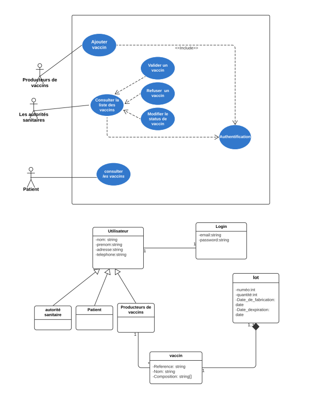
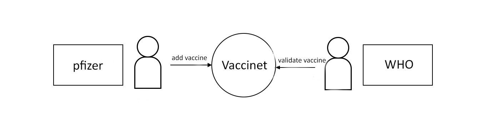
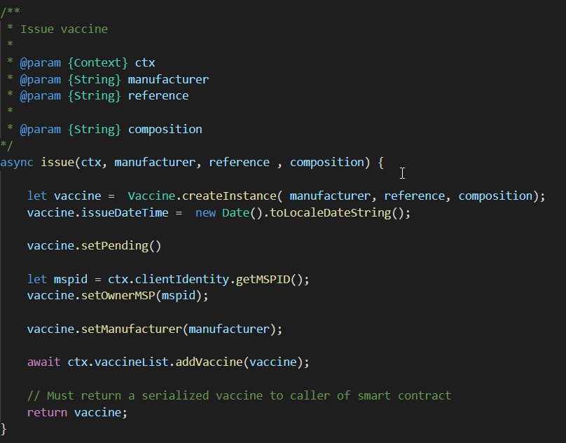

<a name="top"></a>

# Vaccine Verification Project

## The main Problem

The lack of transparency and traceability of interaction with vaccine data facilitates the proliferation of vaccine trafficking circuits in which vaccine manufacturers, health establishments, distributors and health authorities are involved, in particular the appearance black markets, fake vaccines).
This fact has involved the shortage of vaccines, deaths from expired vaccines and immense losses to insurance companies.

<details><summary>Key Objectives </summary>

The goal of our project is to design and develop a decentralized solution that allows the exchange and confirmation of vaccine validity in a secure, fast and transparent way.

We will use the blockchain technology to ensure these goals below:
  * When adding a vaccine, validation of the vaccine by a health authority will be carried out to prevent any type of falsification. 
    
  * Any user can check whether the vaccine has been validated or not at any time.
    
  * Any user can know all the details about the vaccine (date of manufacture, manufacturer, ...)
  
  * Any user can know the constituents of a vaccine to avoid any risk of allergy.

</p>
</details>
 
 Expand the twisty below to see an overview diagram of a 'sample' vaccine marketplace - transactions, queries being executed by different organisations (we'll focus on two of these organisations)

<details><summary>Vaccine verification overview: usecases and diagrams</summary>



</p>
</details>

<sup>[_back to top_](#top)</sup>

## Scenario Overview



In this tutorial two organizations, pfizer and WHO, exchange vaccine information with each other on 'Vaccinet', the marketplace represented by a Hyperledger Fabric blockchain network. 

Client applications (CLI based) are used: 

- to perform the transactions
- run queries (Node.js sample only)
- examine the transaction inputs (as opposed to _states_) that are written to the ledger after you perform a transaction (using the Node.js listener).

This sample uses the `test-network` . You’ll act as Isabella, an employee of pfizer (Org2), who will issue a vaccine on its behalf. You’ll then 'switch hats' to take the role of Balaji, an employee of WHO (Org1), who will validate this vaccine, hold it for a period of time, and then redeem it with pfizer for a small profit or yield. Note that the smart contract sample doesn't enforce the actual hold period ; the user can, in fact, redeem the paper immediately. 

## Quick Start

Below are the quick start instructions for putting in place our project. 


### High-Level Overview of Steps

1) Install Binaries, Start the Hyperledger Fabric infrastructure

   The Fabric 'test-network' will be used - this has two organizations 'Org1' and 'Org2'  WHO will be Org1, and pfizer will be Org2. 

2) Install and Instantiate the Contracts

3) Run client applications in the roles of pfizer and WHO for the validation of the vaccine

   - Add the vaccine as pfizer (org2)
   - validate the vaccine as WHO (org1)

   See also the transaction flow and alternatives in the Scenario Overview below.

<sup>[_back to top_](#top)</sup>

## Setup

A machine with the following is needed

- Docker and docker-compose installed
- Node.js v12 if you want to run JavaScript client applications
- Java v8 if you want to run Java client applications
- Maven to build the Java applications

You will need to install the `peer` cli binaries and cloned the `fabric-samples` repository. Once you have installed the cli binaries, ensure you have added the  `bin` directory (for your `peer` commands used by scripts below) to your exported `PATH` variable in your `.bashrc` or `.profile` directory (per below). This is important as you will be opening a number of windows which will need PATH set. Finally, check that it finds the `peer` command in your PATH using the `which` command  eg.

```
git clone https://github.com/hyperledger/fabric-samples.git
```

Make sure to clone the `vaccine-verification` Project under `fabric-samples`
```
git clone https://github.com/wejdeneHaouari/vaccine-verification.git
```

```
export PATH=<path_to_bin_directory>:$PATH
which peer
```


For the test phase, it is advised to have 3 terminal windows (consoles) open; 

* one to monitor the infrastructure
* one for pfizer 
* one for WHO 

Change to the `vaccine-verification` directory in each window. 


```
cd fabric-samples/vaccine-verification
```

## Running the Infrastructure

In one console window, run the network starter script - this will start the two organization `test-network` blockchain network.

```
./network-starter.sh
```
While the script is running, you will see logs of the test network being deployed.
When the script is complete, you can use the `docker ps` command to see the
Fabric nodes running on your local machine:
```
$ docker ps

CONTAINER ID        IMAGE                               COMMAND                  issueD              STATUS              PORTS                                        NAMES
a86f50ca1907        hyperledger/fabric-peer:latest      "peer node start"        About a minute ago   Up About a minute   7051/tcp, 0.0.0.0:9051->9051/tcp             peer0.org2.example.com
77d0fcaee61b        hyperledger/fabric-peer:latest      "peer node start"        About a minute ago   Up About a minute   0.0.0.0:7051->7051/tcp                       peer0.org1.example.com
7eb5f64bfe5f        hyperledger/fabric-couchdb          "tini -- /docker-ent…"   About a minute ago   Up About a minute   4369/tcp, 9100/tcp, 0.0.0.0:5984->5984/tcp   couchdb0
2438df719f57        hyperledger/fabric-couchdb          "tini -- /docker-ent…"   About a minute ago   Up About a minute   4369/tcp, 9100/tcp, 0.0.0.0:7984->5984/tcp   couchdb1
03373d116c5a        hyperledger/fabric-orderer:latest   "orderer"                About a minute ago   Up About a minute   0.0.0.0:7050->7050/tcp                       orderer.example.com
6b4d87f65909        hyperledger/fabric-ca:latest        "sh -c 'fabric-ca-se…"   About a minute ago   Up About a minute   7054/tcp, 0.0.0.0:8054->8054/tcp             ca_org2
7b01f5454832        hyperledger/fabric-ca:latest        "sh -c 'fabric-ca-se…"   About a minute ago   Up About a minute   7054/tcp, 0.0.0.0:9054->9054/tcp             ca_orderer
87aef6062f23        hyperledger/fabric-ca:latest        "sh -c 'fabric-ca-se…"   About a minute ago   Up About a minute   0.0.0.0:7054->7054/tcp                       ca_org1
```

See if you can map these containers to the nodes of the test network (you may
need to horizontally scroll to locate the information):
* The Org1 peer, `peer0.org1.example.com`, is running in container `a86f50ca1907`
* The Org2 peer, `peer0.org2.example.com`, is running in container `77d0fcaee61b`
* The CouchDB database for the Org1 peer, `couchdb0`, is running in container `7eb5f64bfe5f`
* The CouchDB database for the Org2 peer, `couchdb1`, is running in container `2438df719f57`
* The Ordering node, `orderer.example.com`, is running in container `03373d116c5a`
* The Org1 CA, `ca_org1`, is running in container `87aef6062f23`
* The Org2 CA, `ca_org2`, is running in container `6b4d87f65909`
* The Ordering Org CA, `ca_orderer`, is running in container `7b01f5454832`

These containers all form a [Docker network](https://docs.docker.com/network/)
called `net_test`. You can view the network with the `docker network` command:

```
$ docker network inspect net_test

  [
      {
          "Name": "net_test",
          "Id": "f4c9712139311004b8f7acc14e9f90170c5dcfd8cdd06303c7b074624b44dc9f",
          "issued": "2020-04-28T22:45:38.525016Z",
          "Containers": {
              "03373d116c5abf2ca94f6f00df98bb74f89037f511d6490de4a217ed8b6fbcd0": {
                  "Name": "orderer.example.com",
                  "EndpointID": "0eed871a2aaf9a5dbcf7896aa3c0f53cc61f57b3417d36c56747033fd9f81972",
                  "MacAddress": "02:42:c0:a8:70:05",
                  "IPv4Address": "192.168.112.5/20",
                  "IPv6Address": ""
              },
              "2438df719f57a597de592cfc76db30013adfdcfa0cec5b375f6b7259f67baff8": {
                  "Name": "couchdb1",
                  "EndpointID": "52527fb450a7c80ea509cb571d18e2196a95c630d0f41913de8ed5abbd68993d",
                  "MacAddress": "02:42:c0:a8:70:06",
                  "IPv4Address": "192.168.112.6/20",
                  "IPv6Address": ""
              },
              "6b4d87f65909afd335d7acfe6d79308d6e4b27441b25a829379516e4c7335b88": {
                  "Name": "ca_org2",
                  "EndpointID": "1cc322a995880d76e1dd1f37ddf9c43f86997156124d4ecbb0eba9f833218407",
                  "MacAddress": "02:42:c0:a8:70:04",
                  "IPv4Address": "192.168.112.4/20",
                  "IPv6Address": ""
              },
              "77d0fcaee61b8fff43d33331073ab9ce36561a90370b9ef3f77c663c8434e642": {
                  "Name": "peer0.org1.example.com",
                  "EndpointID": "05d0d34569eee412e28313ba7ee06875a68408257dc47e64c0f4f5ef4a9dc491",
                  "MacAddress": "02:42:c0:a8:70:08",
                  "IPv4Address": "192.168.112.8/20",
                  "IPv6Address": ""
              },
              "7b01f5454832984fcd9650f05b4affce97319f661710705e6381dfb76cd99fdb": {
                  "Name": "ca_orderer",
                  "EndpointID": "057390288a424f49d6e9d6f788049b1e18aa28bccd56d860b2be8ceb8173ef74",
                  "MacAddress": "02:42:c0:a8:70:02",
                  "IPv4Address": "192.168.112.2/20",
                  "IPv6Address": ""
              },
              "7eb5f64bfe5f20701aae8a6660815c4e3a81c3834b71f9e59a62fb99bed1afc7": {
                  "Name": "couchdb0",
                  "EndpointID": "bfe740be15ec9dab7baf3806964e6b1f0b67032ce1b7ae26ac7844a1b422ddc4",
                  "MacAddress": "02:42:c0:a8:70:07",
                  "IPv4Address": "192.168.112.7/20",
                  "IPv6Address": ""
              },
              "87aef6062f2324889074cda80fec8fe014d844e10085827f380a91eea4ccdd74": {
                  "Name": "ca_org1",
                  "EndpointID": "a740090d33ca94dd7c6aaf14a79e1cb35109b549ee291c80195beccc901b16b7",
                  "MacAddress": "02:42:c0:a8:70:03",
                  "IPv4Address": "192.168.112.3/20",
                  "IPv6Address": ""
              },
              "a86f50ca19079f59552e8674932edd02f7f9af93ded14db3b4c404fd6b1abe9c": {
                  "Name": "peer0.org2.example.com",
                  "EndpointID": "6e56772b4783b1879a06f86901786fed1c307966b72475ce4631405ba8bca79a",
                  "MacAddress": "02:42:c0:a8:70:09",
                  "IPv4Address": "192.168.112.9/20",
                  "IPv6Address": ""
              }
          },
          "Options": {},
          "Labels": {}
      }
  ]
```

See how the eight containers use different IP addresses, while being part of a single Docker network. (We've abbreviated the output for clarity.)

Because we are operating the test network as WHO and pfizer,
`peer0.org1.example.com` will belong to the WHO organization while
`peer0.org2.example.com` will be operated by pfizer. Now that the test network is up and running, we can refer to our network as Vaccinet from this point
forward.

To recap: you've downloaded the Hyperledger Fabric samples repository from
GitHub and you've got a Fabric network running on your local machine. Let's now start to play the role of pfizer, who wishes to issue the vaccine.

### Monitor the network as pfizer

Our project allows you to act as two organizations by
providing two separate folders for WHO and pfizer. The two folders
contain the smart contracts and application files for each organization. Because
the two organizations have different roles in the trading of the vaccine,
the application files are different for each organization. Open a new window in
the `fabric-samples` repository and use the following command to change into
the pfizer directory:
```
cd vaccine-verification/organization/pfizer
```
The first thing we are going to do as pfizer is monitor the components
of Vaccinet. An administrator can view the aggregated output from a set
of Docker containers using the `logspout` [tool](https://github.com/gliderlabs/logspout#logspout).
The tool collects the different output streams into one place, making it easy
to see what's happening from a single window. This can be really helpful for
administrators when installing smart contracts or for developers when invoking
smart contracts, for example.

In the pfizer directory, run the following command to run the
`monitordocker.sh`  script and start the `logspout` tool for the containers
associated with Vaccinet running on `net_test`:
```
(pfizer admin)$ ./configuration/cli/monitordocker.sh net_test
...
latest: Pulling from gliderlabs/logspout
4fe2ade4980c: Pull complete
decca452f519: Pull complete
(...)
Starting monitoring on all containers on the network net_test
b7f3586e5d0233de5a454df369b8eadab0613886fc9877529587345fc01a3582
```

Note that you can pass a port number to the above command if the default port in `monitordocker.sh` is already in use.
```
(pfizer admin)$ ./monitordocker.sh net_test <port_number>
```

This window will now show output from the Docker containers for the remainder of the
tutorial, so go ahead and open another command window. The next thing we will do is
examine the smart contract that pfizer will use to issue to the vaccine.

## Examine the vaccine smart contract

`issue` and `validate` are the three functions at the heart of the vaccine smart contract. It is used by applications to submit transactions which
correspondingly issue and validate vaccine on the ledger. Our next
task is to examine this smart contract.

Open a new terminal in the `fabric-samples` directory and change into the
pfizer folder to act as the pfizer developer.
```
cd vaccine-verification/organization/pfizer
```
You can then view the smart contract in the `contract` directory using your chosen editor (example vscode):
```
(pfizer developer)$ code contract
```

In the `lib` directory of the folder, you'll see `vaccinecontract.js` file -- this
contains the vaccine smart contract!

 *An
example code editor displaying the vaccine smart contract in `vaccinecontract.js`*

`vaccinecontract.js` is a JavaScript program designed to run in the Node.js environment. Note the following key program lines:

* `const { Contract, Context } = require('fabric-contract-api');`

  This statement brings into scope two key Hyperledger Fabric classes that will
  be used extensively by the smart contract  -- `Contract` and `Context`. learn more about these classes in the
  [`fabric-shim` JSDOCS](https://hyperledger.github.io/fabric-chaincode-node/).


* `class VaccineContract extends Contract {`

  This defines the smart contract class `Vaccinecontract` based on the
  built-in Fabric `Contract` class.  The methods which implement the key
  transactions to `issue` and `validate` vaccine are defined
  within this class.


* `async issue(ctx, manufacturer, reference , composition) {`

  This method defines the vaccine `issue` transaction for Vaccinet. The parameters that are passed to this method will be used to issue the new vaccine.
  Other code details can be found under the contract folder of each organization.

## Deploy the smart contract to the channel

Before `vaccinecontract` can be invoked by applications, it must be installed onto
the appropriate peer nodes of the test network and then defined on the channel
using the [Fabric chaincode lifecycle](../chaincode_lifecycle.html#chaincode-lifecycle). The Fabric chaincode
lifecycle allows multiple organizations to agree to the parameters of a chaincode
before the chaincode is deployed to a channel. As a result, we need to install
and approve the chaincode as administrators of both pfizer and WHO.

Smart contracts are the focus of application development, and are contained
within a Hyperledger Fabric artifact called [chaincode](../chaincode.html). One
or more smart contracts can be defined within a single chaincode, and installing
a chaincode will allow them to be consumed by the different organizations in
Vaccinet. It means that only administrators need to worry about chaincode;
everyone else can think in terms of smart contracts.

### Install and approve the smart contract as pfizer

We will first install and approve the smart contract as the pfizer admin. Make
sure that you are operating from the `pfizer` folder, or navigate back to that
folder using the following command:
```
cd vaccine-verification/organization/pfizer
```

A pfizer administrator can interact with Vaccinet using the `peer` CLI. However,
the administrator needs to set certain environment variables in their command
window to use the correct set of `peer` binaries, send commands to the address
of the pfizer peer, and sign requests with the correct cryptographic material.

You can use a script provided by the sample to set the environment variables in
your command window. Run the following command in the `pfizer` directory:
```
source pfizer.sh
```

You will see the full list of environment variables printed in your window. We
can now use this command window to interact with Vaccinet as the pfizer
administrator.

The first step is to install the `vaccinecontract` smart contract. The smart
contract can be packaged into a chaincode using the
`peer lifecycle chaincode package` command. In the pfizer administrator's
command window, run the following command to issue the chaincode package:
```
(pfizer admin)$ peer lifecycle chaincode package cp.tar.gz --lang node --path ./contract --label cp_0
```
The pfizer admin can now install the chaincode on the pfizer peer using
the `peer lifecycle chaincode install` command:
```
(pfizer admin)$ peer lifecycle chaincode install cp.tar.gz
```
When the chaincode package is installed, you will see messages similar to the following
printed in your terminal:
```
2020-01-30 18:32:33.762 EST [cli.lifecycle.chaincode] submitInstallProposal -> INFO 001 Installed remotely: response:<status:200 payload:"\nEcp_0:ffda93e26b183e231b7e9d5051e1ee7ca47fbf24f00a8376ec54120b1a2a335c\022\004cp_0" >
2020-01-30 18:32:33.762 EST [cli.lifecycle.chaincode] submitInstallProposal -> INFO 002 Chaincode code package identifier: cp_0:ffda93e26b183e231b7e9d5051e1ee7ca47fbf24f00a8376ec54120b1a2a335c
```
Because the pfizer admin has set `CORE_PEER_ADDRESS=localhost:9051` to
target its commands to `peer0.org2.example.com`, the `INFO 001 Installed remotely...`
indicates that `vaccinecontract` has been successfully installed on this peer.

After we install the smart contract, we need to approve the chaincode definition
for `vaccinecontract` as pfizer. The first step is to find the packageID of
the chaincode we installed on our peer. We can query the packageID using the
`peer lifecycle chaincode queryinstalled` command:
```
peer lifecycle chaincode queryinstalled
```

The command will return the same package identifier as the install command. You
should see output similar to the following:
```
Installed chaincodes on peer:
Package ID: cp_0:ffda93e26b183e231b7e9d5051e1ee7ca47fbf24f00a8376ec54120b1a2a335c, Label: cp_0
```

We will need the package ID in the next step, so we will save it as an environment
variable. The package ID may not be the same for all users, so you need to
complete this step using the package ID returned from your command window.
```
export PACKAGE_ID=cp_0:ffda93e26b183e231b7e9d5051e1ee7ca47fbf24f00a8376ec54120b1a2a335c
```

The admin can now approve the chaincode definition for pfizer using the
`peer lifecycle chaincode approveformyorg` command:
```
(pfizer admin)$ peer lifecycle chaincode approveformyorg --orderer localhost:7050 --ordererTLSHostnameOverride orderer.example.com --channelID mychannel --name vaccinecontract -v 0 --package-id $PACKAGE_ID --sequence 1 --tls --cafile $ORDERER_CA
```

One of the most important chaincode parameters that channel members need to
agree to using the chaincode definition is the chaincode [endorsement policy](../endorsement-policies.html).
The endorsement policy describes the set of organizations that must endorse
(execute and sign) a transaction before it can be determined to be valid. By
approving the `vaccinecontract` chaincode without the ``--policy`` flag, the
pfizer admin agrees to using the channel's default `Endorsement` policy,
which in the case of the `mychannel` test channel requires a
majority of organizations on the channel to endorse a transaction. All transactions,
whether valid or invalid, will be recorded on the [ledger blockchain](../ledger/ledger.html#blockchain),
but only valid transactions will update the [world state](../ledger/ledger.html#world-state).

### Install and approve the smart contract as WHO

Based on the `mychannel` `LifecycleEndorsement` policy, the Fabric Chaincode lifecycle
will require a majority of organizations on the channel to agree to the chaincode
definition before the chaincode can be committed to the channel.
This implies that we need to approve the `Vaccinet` chaincode as both pfizer
and WHO to get the required majority of 2 out of 2. Open a new terminal
window in the `fabric-samples` and navigate to the folder that contains the
WHO smart contract and application files:
```
(WHO admin)$ cd vaccine-verification/organization/WHO/
```
Use the script in the WHO folder to set the environment variables that will
allow you to act as the WHO admin:
```
source WHO.sh
```

We can now install and approve `vaccinecontract` as the WHO. Run the following
command to package the chaincode:
```
(WHO admin)$ peer lifecycle chaincode package cp.tar.gz --lang node --path ./contract --label cp_0
```
The admin can now install the chaincode on the WHO peer:
```
(WHO admin)$ peer lifecycle chaincode install cp.tar.gz
```
We then need to query and save the packageID of the chaincode that was just
installed:
```
(WHO admin)$ peer lifecycle chaincode queryinstalled
```
Save the package ID as an environment variable. Complete this step using the
package ID returned from your console.
```
export PACKAGE_ID=cp_0:ffda93e26b183e231b7e9d5051e1ee7ca47fbf24f00a8376ec54120b1a2a335c
```

The WHO admin can now approve the chaincode definition of `vaccinecontract`:
```
(WHO admin)$ peer lifecycle chaincode approveformyorg --orderer localhost:7050 --ordererTLSHostnameOverride orderer.example.com --channelID mychannel --name vaccinecontract -v 0 --package-id $PACKAGE_ID --sequence 1 --tls --cafile $ORDERER_CA
```

### Commit the chaincode definition to the channel

Now that WHO and pfizer have both approved the `Vaccinet` chaincode, we
have the majority we need (2 out of 2) to commit the chaincode definition to the
channel. Once the chaincode is successfully defined on the channel, the
`CommercialPaper` smart contract inside the `vaccinecontract` chaincode can be
invoked by client applications on the channel. Since either organization can
commit the chaincode to the channel, we will continue operating as the
WHO admin.

The WHO administrator uses the `peer lifecycle chaincode commit` command
to commit the chaincode definition of `vaccinecontract` to `mychannel`:
```
(WHO admin)$ peer lifecycle chaincode commit -o localhost:7050 --ordererTLSHostnameOverride orderer.example.com --peerAddresses localhost:7051 --tlsRootCertFiles ${PEER0_ORG1_CA} --peerAddresses localhost:9051 --tlsRootCertFiles ${PEER0_ORG2_CA} --channelID mychannel --name vaccinecontract -v 0 --sequence 1 --tls --cafile $ORDERER_CA --waitForEvent
```
The chaincode container will start after the chaincode definition has been
committed to the channel. You can use the `docker ps` command to see
`vaccinecontract` container starting on both peers.

```
(WHO admin)$ docker ps

CONTAINER ID        IMAGE                                                                                                                                                               COMMAND                  issueD             STATUS              PORTS                                        NAMES
d4ba9dc9c55f        dev-peer0.org1.example.com-cp_0-ebef35e7f1f25eea1dcc6fcad5019477cd7f434c6a5dcaf4e81744e282903535-05cf67c20543ee1c24cf7dfe74abce99785374db15b3bc1de2da372700c25608   "docker-entrypoint.s…"   30 seconds ago      Up 28 seconds                                                    dev-peer0.org1.example.com-cp_0-ebef35e7f1f25eea1dcc6fcad5019477cd7f434c6a5dcaf4e81744e282903535
a944c0f8b6d6        dev-peer0.org2.example.com-cp_0-1487670371e56d107b5e980ce7f66172c89251ab21d484c7f988c02912ddeaec-1a147b6fd2a8bd2ae12db824fad8d08a811c30cc70bc5b6bc49a2cbebc2e71ee   "docker-entrypoint.s…"   31 seconds ago      Up 28 seconds                                                    dev-peer0.org2.example.com-cp_0-1487670371e56d107b5e980ce7f66172c89251ab21d484c7f988c02912ddeaec
```

Notice that the containers are named to indicate the peer that started it, and
the fact that it's running `vaccinecontract` version `0`.

Now that we have deployed the `vaccinecontract` chaincode to the channel, we can
use the pfizer application to issue the vaccine. Let's take a
moment to examine the application structure.

## Client Applications

Note for JavaScript applications, you will need to install the dependencies first. Use this command in each application directory

```
npm install
```

The docker containers don't contain the node runtime; so it is best to exit the docker containers - but keep the windows open and run the applications locally.

As mentioned earlier in the Sample introduction section, transaction _inputs_ are recorded on the ledger, as well as any asset _state_ changes. Just *before* you run the _issue_ application script below - you need to launch a block 'listener' application that will show you these _inputs_, as you complete each transaction in the vaccine verification lifecycle (eg. vaccine Number: 00001, 00002 etc) . 

For the listener, its best to open a *new* terminal for this in the `vaccine-verification/organization/pfizer/application` directory (javascript). Next, run the `addToWallet` step in the `add` transaction below, to add Isabella's identity to the wallet - the listener will use this wallet. Once the listener is launched, it will show the inputs for transactions you will perform and which are committed to blocks (ie part of the ledger).  Note: initially, the listener may show a spurious message, and then go into a _listening_ or 'wait' state. As transactions complete below, messages will be displayed by the listener - so keep an eye out. *After* adding Isabella's wallet, you can then launch the listener as follows:

```
node cpListener.js
```

**<details><summary>Add the vaccine</summary>**

The vaccine is Added by *pfizer* 

You can now run the applications to add the vaccine. Change to the `vaccine-verification/organization/pfizer/application` directory

*Add the Identity to be used to the wallet*

```
node addToWallet.js
```

*Add the vaccine*

```
node addVaccine.js
```

Don't forget to check the application listener for messages above!

</p>
</details>


**<details><summary>validate the vaccine</summary>**

_validate_ is performed as *WHO*; 

You can now run the applications to validate the paper. Change to either the
`vaccine-verification/organization/WHO/application` directory or  `vaccine-verification/organization/WHO/application-java`

*Add the Identity to be used*

```
node addToWallet.js
```

*validate the paper*

```
node validate.js
```

</p>
</details>


When you're done with this section, return to the terminal where your Node.js _listener_ application is running, and terminate the process.

## Clean up
When you are finished using the Fabric test network and the vaccine smart contract and applications, you can use the following command to clean up the network:

```
./network-clean.sh 
```

<sup>[_back to top_](#top)</sup>
